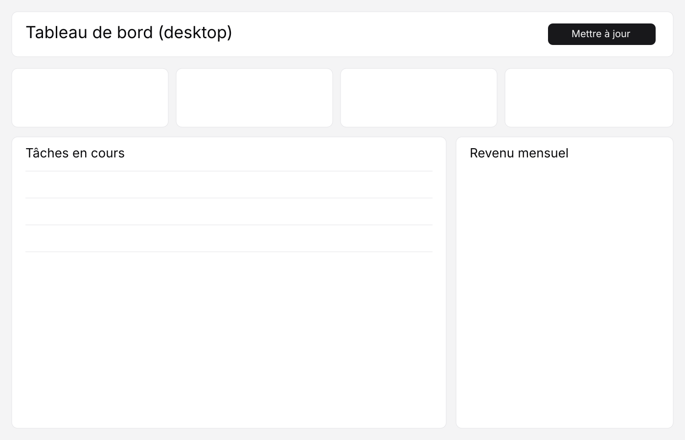
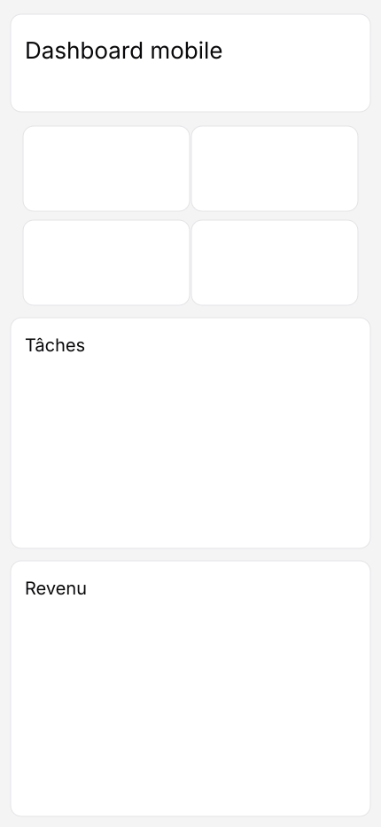

# shadcn-wa-starter

Dashboard statique en **HTML/CSS/JS** avec **WebAwesome** + **Alpine.js**, thème visuel inspiré de **shadcn/ui**, sans backend.

## Fonctionnalités

- Composants WebAwesome (input, bouton, badge, select, switch)
- Interactions Alpine.js (filtre des tâches, mise à jour des revenus)
- Données mockées localement dans `data.js`
- Design responsive (desktop + mobile)
- Déploiement GitHub Pages via GitHub Actions

## Structure

- `index.html` : structure UI
- `styles.css` : thème shadcn-like + responsive
- `data.js` : mock des données
- `app.js` : logique interactive Alpine.js
- `.github/workflows/deploy.yml` : pipeline de déploiement GitHub Pages

## Screenshots

### Desktop

### Mobile

## Déploiement GitHub Pages

1. Pousser la branche sur GitHub (`main` pour le workflow actuel).
2. Dans **Settings → Pages**, choisir **GitHub Actions** comme source si nécessaire.
3. Le workflow `.github/workflows/deploy.yml` publie automatiquement le site.

## Développement local

Ouvrir simplement `index.html` dans un navigateur (aucun serveur requis).
